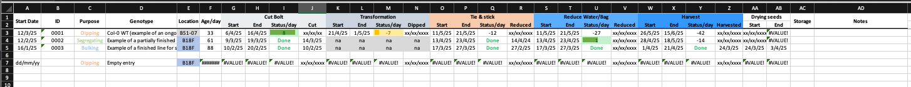
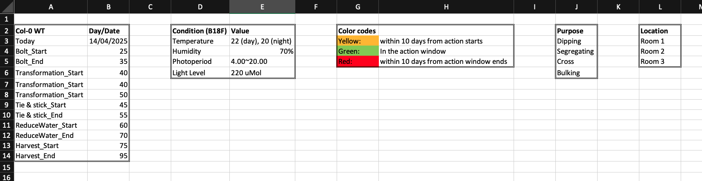
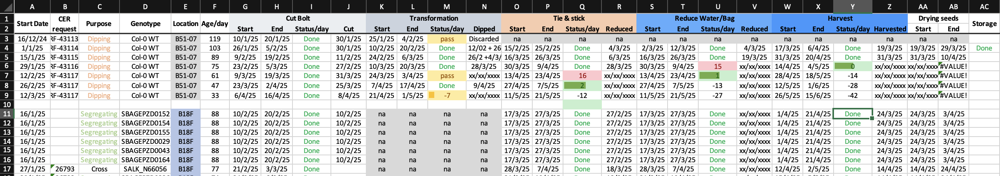

# plantWork-tracker

In plant science research, we often have to grow many plants at the same time, and it can be hard to keep track of all the different actions we need to do for each plant. This is especially true when we have different species and plants in different locations/ages/genetic backgrounds, or when we are doing different experiments with different plants.

This is a simple spreadsheet that you can use to track the growth of plants and the actions you need to do for them. I initially made it for tracking Arabidopsis (Col-0) activities such as seed bulking, segregation, and floral dipping, but I think it can also easily be adapted for other species, genetic backgrounds, and experimental setups.

I have trailed it with my own plants, and some action times are still to be confirmed. I would love to hear your feedback on the timing of the actions, and any other suggestions you have for improving the spreadsheet :)!

## Main features of the spreadsheet

Here is a screenshot of the "Inventory" tab of the spreadsheet, and I will explain the main features below.

1. Columns:
   1. **Start Date**: The date you grow the plants.
   2. **ID**: This is where you can give each batch of plants a unique ID if needed. For our institute, we need to send horticulture service requests for growing plants in the greenhouse. This column is for tracking the request number.
   3. **Purpose**: The purpose of the plants. I have made a dropdown list for this, and you can add your own options in the “Action" tab.
   4. Genotype: genotypes or species of the plants you are growing.
   5. Location: The location of the plants. I have made a dropdown list for this, and you can add your own options in the “Action” tab.
   6. Age/days: The age of the plants in days. This is calculated from the start date and the current date automatically.
   7. Then you will find a series of action columns for each of the main actions I normally do to babysit Arabidopsis. I will talk about details in the next section. The action columns are:
      1. Cut Bolt: cut early bolts of young plants to promote more branches.
      2. Transformation (i.e. floral dipping)
      3. Tie & stick: tie bolts of plants to a stick.
      4. Reduce Water/Bag: reduce water to the plants and bag them for seed harvesting.
      5. Harvest: harvest the seeds.
      6. Drying seeds: dry the harvested seeds in a oven for storage. Note that the date for this is calculated based on when the seeds are harvested. So filling in the harvest date is necessary for this to work.
2. Action series: Each action has four columns:
   1. Start: The start date of the action. This is calculated from plants' age and preset for each action, which you can review&modify in the "Action" tab.
   2. End: End date of the action, usually 10 days after the start date. Again this is calculated from the start date and preset for each action, which you can review&modify in the "Action" tab.
   3. Status/day: Status of the action on the current date. This is estimated from the start and end dates of the action. The status will be set to yellow if it is within 10 days of the start date, green if it is within the action window, and red if it has past the end date for 10 days. You can also manually set the status to "Done", "pass" or "na" to mark the action as complete or not relevant anymore. The status will turn green, yellow or grey, respectively.
   4. Last column for each action is for you to write down the date that the action is actually performed.
3. "Action" tab (snapshot below) contains the preset timings, description of color codes, growth conditions, and dropdown lists for "Purpose" and "Location" columns.

Below is a screenshot of my own spreadsheet at the time of writing this.

## Quick Start

1. Download the most recent release here #todo.
2. Check if the action points and timings are suitable for your plants. You can change the action windows and preset ages in the “Action” tab. The current preset ages are based on Arabidopsis Col-0 wild type plants growing at **16h light/8h dark cycle, 220 uMol light, 20~22oC**.
3. Making a copy of the 'Empty entry' line and adding the **Start Date** is all you need really! Once it is filled in you will see dates for all the actions coming out. If you want to record more information (recommended!), then fill in ID, Purpose, Genotype, and Location.
4. When an action is performed, fill in the date in the last column of the action. Also write "Done"/"pass"/"na" in the status column. The color will be updated automatically.

## Features to be added

As of 14/04/2025

1. Add email notification for actions that are coming next/ongoing/overdue.
2. Allow to use different preset timings for different species/genotypes, depending on information given in the "Genotype" column.